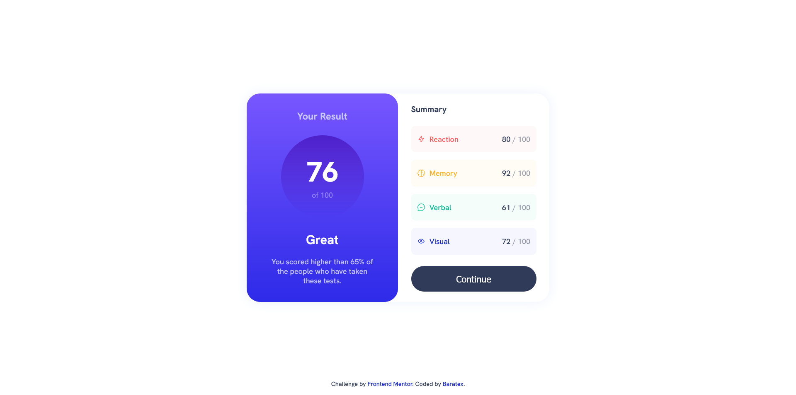
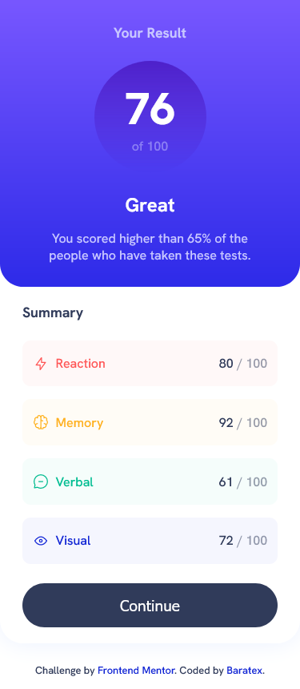

# Frontend Mentor - Results summary component solution

This is a solution to the [Results summary component challenge on Frontend Mentor](https://www.frontendmentor.io/challenges/results-summary-component-CE_K6s0maV). Frontend Mentor challenges help you improve your coding skills by building realistic projects. 

## Table of contents

- [Overview](#overview)
  - [The challenge](#the-challenge)
  - [Screenshot](#screenshot)
  - [Links](#links)
- [My process](#my-process)
  - [Built with](#built-with)
  - [What I learned](#what-i-learned)
  - [Continued development](#continued-development)
  - [Useful resources](#useful-resources)
- [Author](#author)
- [Acknowledgments](#acknowledgments)

## Overview

First time using .json file to add information dynamically to the html.
Also First time doing mobile design first, and then switching to the desktop version.

### The challenge

Users should be able to:

- View the optimal layout for the interface depending on their device's screen size
- See hover and focus states for all interactive elements on the page

### Screenshot





### Links

- Solution URL: [Add solution URL here](https://github.com/baratex/frontendmentor-result-summary/)
- Live Site URL: [Add live site URL here](https://baratex.github.io/frontendmentor-result-summary/)

## My process

### Built with

- Semantic HTML5 markup
- CSS custom properties
- Flexbox
- CSS Grid
- Mobile-first workflow
- JS dynamically applying json file information

### What I learned

Thisi s the first time I applyed JS to update the data in a website from a json file. Below follows the code.

```JS
document.addEventListener('DOMContentLoaded', function(){
    const req = new XMLHttpRequest();
    req.open("GET",'./data.json',true);
    req.send();
    req.onload = function(){
        const json = JSON.parse(req.responseText);
        let avg = 0;

        for (let i = 0; i < json.length; i++){
            document.getElementsByClassName('img' + i)[0].src = json[i].icon;
            document.getElementsByClassName('cat' + i)[0].innerHTML = json[i].category;
            document.getElementsByClassName('points' + i)[0].innerHTML = json[i].score;

            avg += json[i].score;
        };

        document.getElementsByClassName('average')[0].innerHTML = Math.round(avg / json.length);

    };
});
```

## Author

- Website - [Bruno Barato](https://github.com/baratex)
- Frontend Mentor - [@baratex](https://www.frontendmentor.io/profile/baratex)

**Note: Delete this note and add/remove/edit lines above based on what links you'd like to share.**

## Acknowledgments

Acknoledge to freecodecamp Data VIsualization, JSON APIs and AJAX course.

